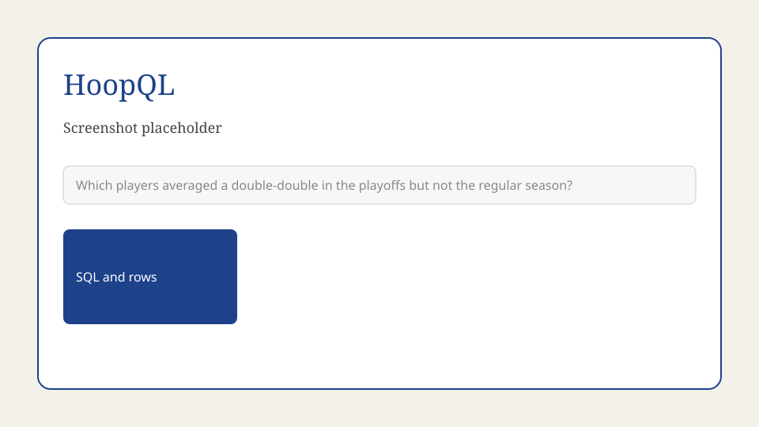
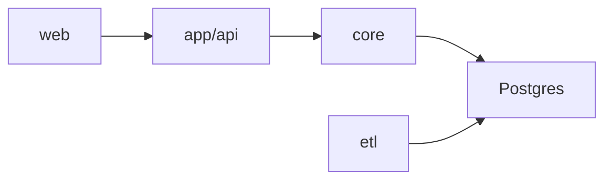

# HoopQL

HoopQL answers basketball questions that need a calculation over player game logs, not a page you can look up. You ask in English. It returns the SQL it ran and the rows that SQL produced, so the answer can be checked.



Live app: not published yet. The public URL is planned for 19 Oct 2026.

## Local setup

Install [uv](https://docs.astral.sh/uv/) if you do not already have it, then:

```bash
uv sync
cp .env.example .env
docker compose up --build
```

Postgres listens on `localhost:5432` (`hoopql` / `hoopql`, database `hoopql`). The API listens on `http://localhost:8000`. `GET /health` returns `{"status":"ok"}`. The question endpoint is not built yet.

`make dev` is the same Compose command. `make test` runs the unit tests. `make eval` is reserved for the evaluation runner.

## Architecture



The web app sends a question to the API. The API runs the core pipeline: schema retrieval, value grounding, few-shot examples, SQL generation, validation, and execution against Postgres. A nightly ETL job loads NBA game logs into that database. The web app and the pipeline stages after health are still empty; this repository is the layout they will land in.

## Research origin

The training runs, notebooks, and write-up that this product grew out of are frozen under [research/](research/). The write-up is [research/final_writeup.pdf](research/final_writeup.pdf). Summary tables and per-run dumps are in [research/results/](research/results/). Reproduce that environment with `research/scripts/setup_venv.sh` and `research/requirements.txt`. It is separate from `uv sync`.
